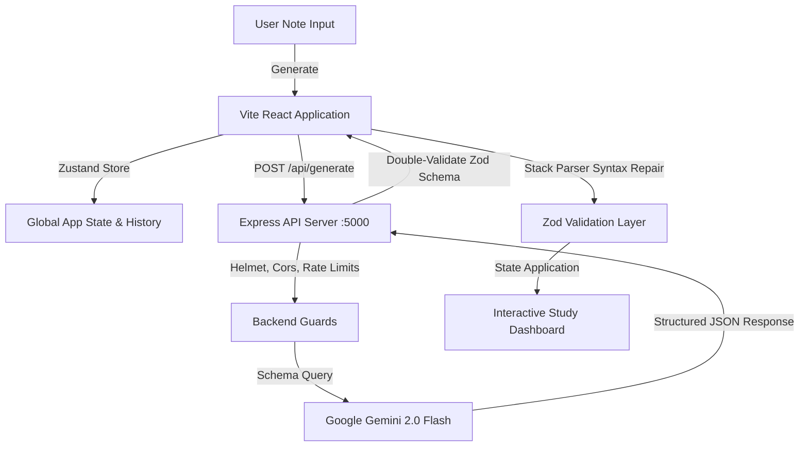

# Next-Gen AI Study Assistant

An interactive, production-grade cognitive study workspace designed for engineering students. The application parses complex textbooks, notes, and topics, translating dry technical text into rich active-recall assets: summaries with speech playback, interactive 3D flipping flashcards with drag-and-drop reordering, and gamified multiple-choice quiz modules.

It features a secure Express backend that queries Google Gemini 2.0 Flash using structured schema configurations, verifies payload constraints via server/client Zod layers, and logs detailed performance diagnostics.

---

## 1. System Architecture



### Folder Structure
```text
Flam (Workspace Root)
├── .github/workflows
│   └── ci.yml               # GitHub Actions CI pipeline
├── server
│   ├── .env                 # Backend keys config
│   ├── package.json         # Backend node packages
│   └── server.js            # Express endpoint & rate limiters
├── src
│   ├── components
│   │   ├── CommandPalette.tsx  # Fuzzy search spotlight menu
│   │   ├── ErrorBoundary.tsx   # React runtime crash boundary
│   │   └── Navbar.tsx          # Responsive navigation & streak counter
│   ├── pages
│   │   ├── Dashboard.tsx       # Note paste area, optimistic loading, skeletons
│   │   ├── History.tsx         # Ingest history logs & telemetry diagnostics
│   │   └── Study.tsx           # Study tabs, 3D cards, MCQs, statistics panels
│   ├── store
│   │   └── studyStore.ts       # Zustand state management
│   ├── utils
│   │   ├── jsonValidator.ts    # Zod schemas & stack-based repair pipeline
│   │   └── jsonValidator.test.ts # Vitest unit test files
│   ├── App.tsx                 # Core shell, lazy imports & routes
│   └── index.css               # Design system classes
└── package.json             # Root React configuration
```

---

## 2. Ingestion & Data Flow

1. **Optimistic Transition**: The user types/pastes note text and clicks "Generate". The text editor immediately slides upward using Framer Motion layout rules, and loading skeletons slide in place instantly.
2. **Cancellation**: If a new session is requested while another is pending, `AbortController.abort()` terminates the outstanding connection, preventing stale payloads from overwriting the UI.
3. **Structured Generation**: The backend requests Google Gemini 2.0 Flash specifying `responseMimeType: "application/json"` and passing structured parameters.
4. **Validation & Repair**:
   - The server validates the JSON payload with a Zod schema before returning it.
   - If the JSON has minor format glitches (code blocks, trailing commas, unclosed brackets), the frontend runs a LIFO stack-based text correction.
   - If key arrays or fields are missing, the UI intercepts compilation and renders a collapsed Error Details accordion showing exact diagnostic fields (`Validation failed`, `Timeout`, `Rate limit exceeded`, etc.).

---

## 3. Key Feature Sets

- **3D Active Recall Cards**: Flip cards with Spacebar, navigate through the deck using Arrow Keys, toggle favorites/bookmarks, and reorder card lists using native HTML5 drag elements combined with Framer Motion `layout` slide transitions.
- **MCQ Quiz Module**: Features 30-second countdown timers, incorrect question collection for retakes, option justifications, and canvas-confetti celebrations on 100% completion.
- **Fuzzy Command Palette (`Ctrl + K`)**: Floating command console matching inputs with actions: navigate modules, shuffle decks, toggle light/dark modes, and export study summaries to PDF.
- **Hidden Developer Panel (`Ctrl + Shift + D`)**: Displays system diagnostics (Response Times, Parser Latencies, and client-side render duration measured using the Performance API).

---

## 4. Accessibility & Performance Compliance

- **WCAG AA Compliance**: 
  - Uses semantic landmarks (`<main>`, `<nav>`, `<section>`).
  - Implements keyboard focus traps within dialog palette overlays.
  - Supports system configurations like `prefers-reduced-motion` to skip framer layout transitions.
  - Accessible screen reader link anchors ("Skip to Content") placed at the root level.
- **Optimized Performance**:
  - Route code-splitting with `React.lazy` and `Suspense`.
  - Memoized card and log arrays using `React.memo` and `useMemo` selectors to prevent unnecessary render loops.

---

## 5. Local Setup & Testing

### Installation & Run
1. Navigate to the `server` directory and add your key:
   ```bash
   cd server
   # Create a .env file and write:
   PORT=5000
   GEMINI_API_KEY=your_gemini_api_key_here
   ```
2. Start the Express server:
   ```bash
   npm install
   npm start
   ```
3. Start the Vite development client in another terminal:
   ```bash
   # From the root directory:
   npm install
   npm run dev
   ```

### Execution of Tests
Run the unit test suite:
```bash
npx vitest run
```

---

## 6. AI Usage & Disclosure

This project utilizes Google Gemini 2.0 Flash. The integration adheres strictly to structured JSON layouts by passing schema constraints directly to the Vertex AI API configuration, preventing unstructured markdown explanations from entering the data layers. All AI generations are validated client-side and server-side using Zod.
